## Vježba 1

Prvo je trebalo instalirat WinHex priko poveznice. Kad se instalira, otvori se editor:

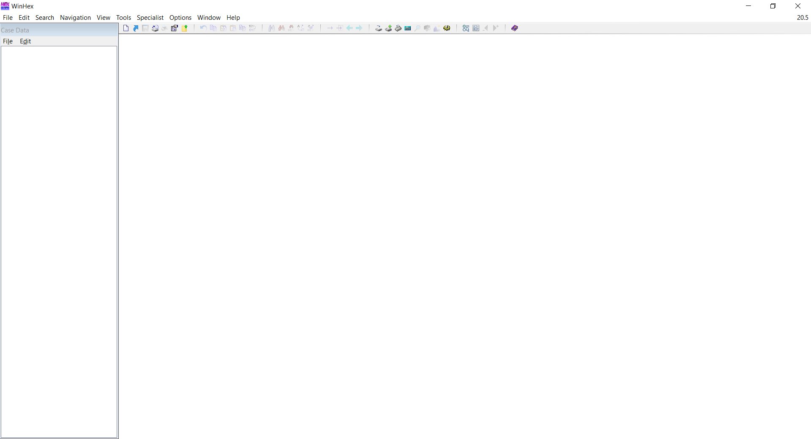

Nakon toga, preko File -> Open se otvore ova tri datoteke koje smo downloadali:

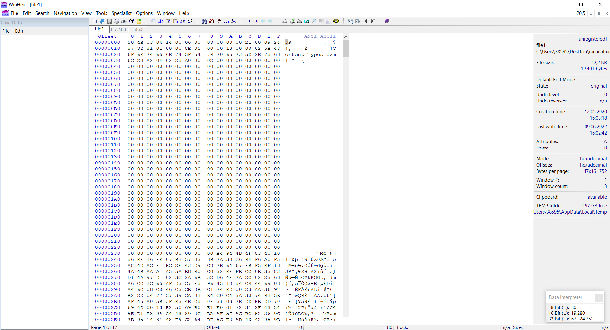

Kako pročitat koji je tip datoteke ? -> pogledamo prva dva hexa unutar editora za svaki file te ih onda potražimo u tablici potpisa. Ta prva dva hexa predstavljaju potpis datoteke i tako možemo otkrit koji je tip datoteke

# file1

---

Za prvi file, ovo je njegov potpis:

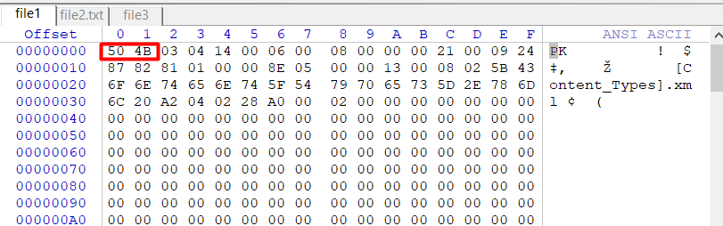

Kada to potražimo u tablici, vidit ćemo da je ovo neki kompresirani file(.zip, .rar)

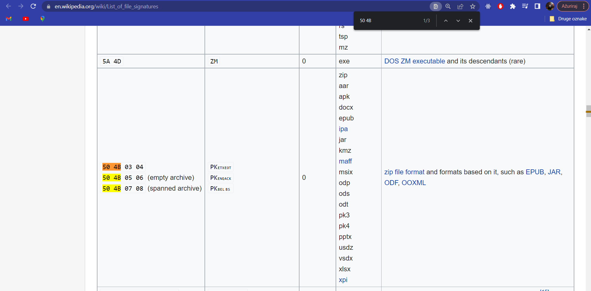

To možemo provjerit tako što promijenimo ime datoteci i otvorimo je:

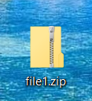
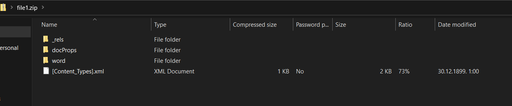

# file2.txt

---

Potpis za drugu datoteku:

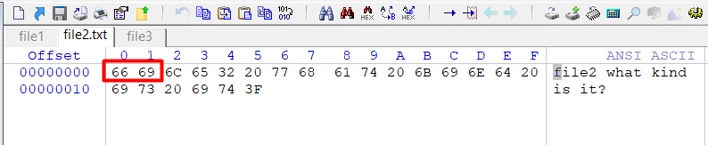

Kad potražimo u tablici, vidit ćemo da je to .vhdx file, tj. Windows Virtual PC Windows 8 Virtual Hard Disk file format

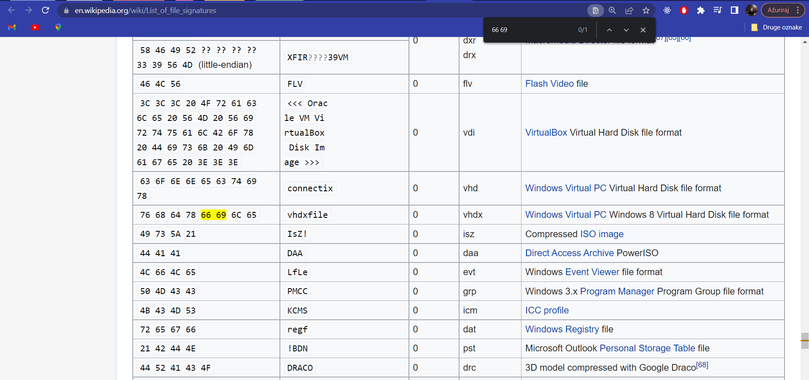

Nakon promjene imena:

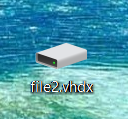
Yeah...neću van ovo otvorit

# file3

---

Potpis za treću datoteku:

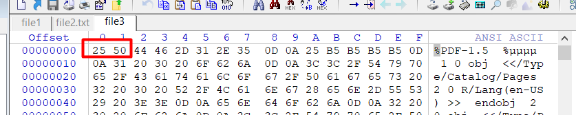

Kada se potraži u tablici, vidimo da je ovo .PDF file

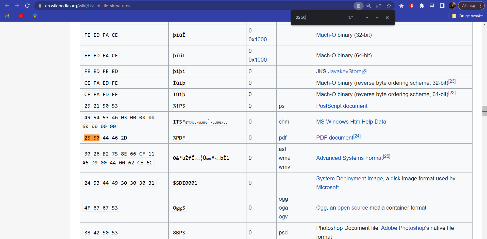

Provjera tako što promijenimo ime datoteci:

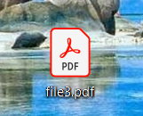
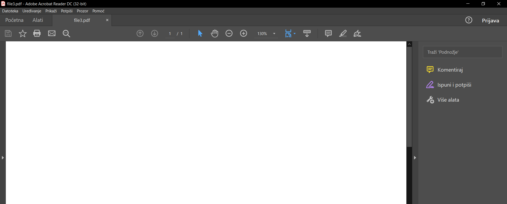
